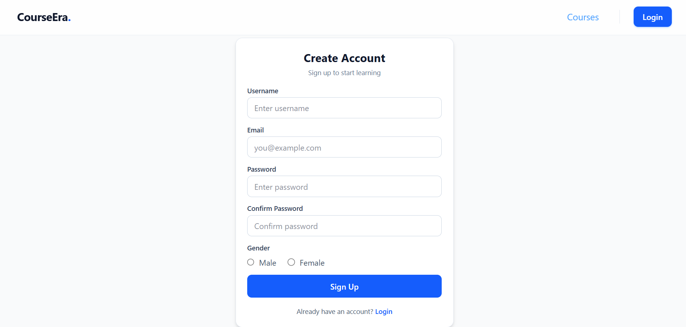
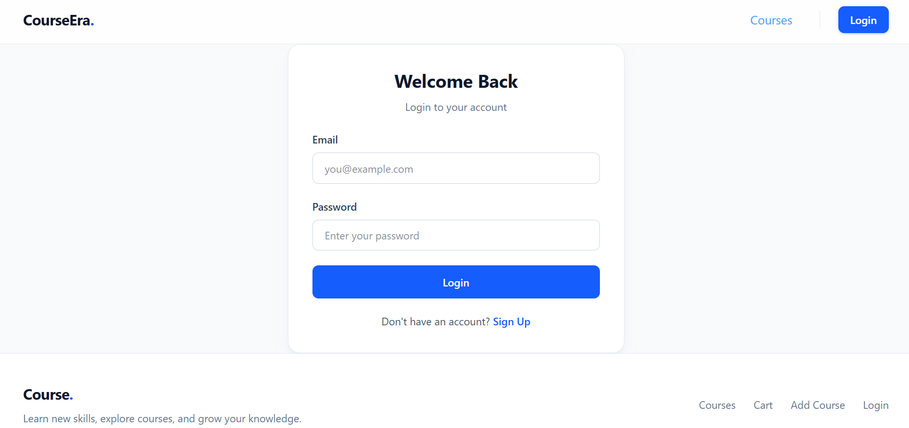
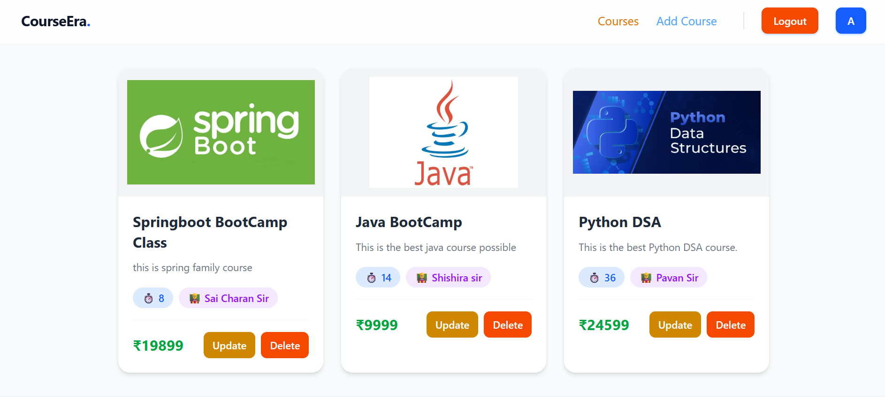
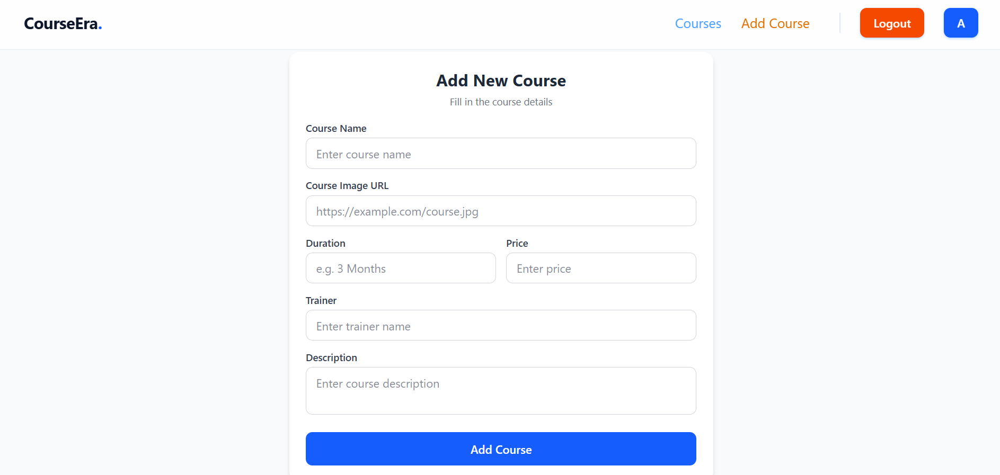
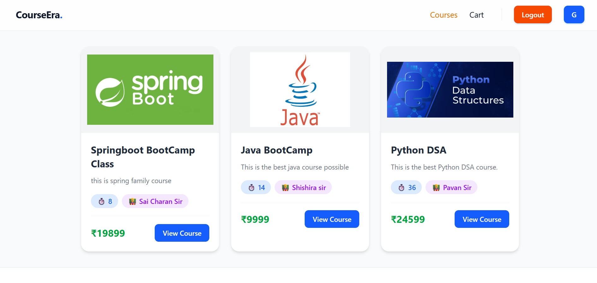
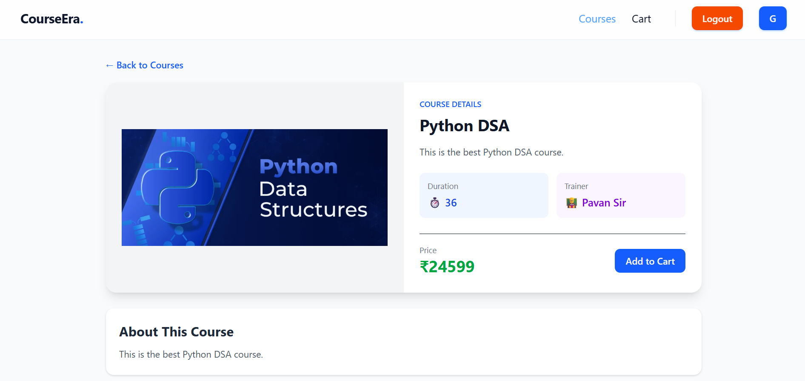

<h1 align="center">🎓 Course Management System</h1>

<p align="center">
  
  
  
  
  
  
</p>

<h3 align="center">
📚 Learn • Manage • Enroll
</h3>

<p align="center">
Course Management System is a responsive React web application that enables users to browse, add, update, and manage courses through a clean and interactive interface. The project demonstrates modern React concepts including Context API, React Router, protected routes, state management, and CRUD operations using a JSON-based backend.
</p>

---

# 📚 Table of Contents

- [Features](#-features)
- [Tech Stack](#-tech-stack)
- [Technical Highlights](#-technical-highlights)
- [Project Preview](#-project-preview)
- [Architecture](#-architecture)
- [Application Workflow](#-application-workflow)
- [Project Structure](#-project-structure)
- [Installation](#️-installation)
- [Future Enhancements](#-future-enhancements)
- [Learning Outcomes](#-learning-outcomes)
- [About the Developer](#-about-the-developer)

---

# 📌 Features

- 🔐 User Registration & Login
- 🛡️ Protected & Private Routes
- 📚 Browse Available Courses
- ➕ Add New Courses
- ✏️ Update Existing Courses
- 🛒 Course Cart Management
- 🔍 Course Details Page
- ⚡ CRUD Operations
- 🌐 Context API State Management
- 📱 Fully Responsive User Interface

---

# 🛠️ Tech Stack

| Category | Technologies |
|----------|--------------|
| Frontend | React 19, JavaScript (ES6) |
| Routing | React Router DOM |
| State Management | Context API |
| Backend | JSON Server |
| Styling | HTML5, CSS3 |
| Build Tool | Vite |
| Version Control | Git & GitHub |

---

# 🚀 Technical Highlights

- React Functional Components
- Context API for Global State
- React Router DOM Navigation
- Protected & Private Routes
- CRUD Operations
- Component-Based Architecture
- Dynamic Form Handling
- Responsive Web Design
- JSON Server Integration
- Modern React Hooks

---

# 📸 Project Preview

## 🔐 Account Creation & Authentication

The authentication flow includes a detailed registration form and a clean login interface for returning users.

<h3 align="center">Registration Page</h3>

<p align="center">
  
</p>

<h3 align="center">Login Page</h3>

<p align="center">
  
</p>

---

## 👨‍💼 Admin Dashboard

The admin dashboard allows administrators to manage courses by viewing, editing, deleting, and adding new courses.

<h3 align="center">Course Management Dashboard</h3>

<p align="center">
  
</p>

<h3 align="center">Add New Course</h3>

<p align="center">
  
</p>

---

## 👨‍🎓 User Experience

Users can browse the complete course catalog, explore detailed course information, and manage their selected courses through the cart.

<h3 align="center">Course Catalog</h3>

<p align="center">
  
</p>

<h3 align="center">Course Details</h3>

<p align="center">
  
</p>

---

# 🏗️ Architecture

```text
User
   │
   ▼
React Frontend
   │
   ▼
React Router
   │
   ▼
Pages & Components
   │
   ▼
Context API
   │
   ▼
JSON Server
   │
   ▼
database.json
```

---

# 🔄 Application Workflow

```text
Register
      │
      ▼
User Account Created
      │
      ▼
Login
      │
      ▼
Authentication
      │
      ▼
Access Protected Pages
      │
      ▼
Browse Courses
      │
      ▼
Add / Update Courses
      │
      ▼
Manage Cart
      │
      ▼
Logout
```

---

# 📂 Project Structure

```text
Course-Management-System/
│
├── backend/
│   ├── database.json
│   └── server.js
│
├── public/
│
├── screenshots/
│   ├── registration-page.png
│   ├── login-page.png
│   ├── admin-dashboard.png
│   ├── add-course-form.png
│   ├── user-course-catalog.png
│   └── course-details-page.png
│
├── src/
│   ├── components/
│   ├── context/
│   ├── pages/
│   ├── routes/
│   ├── App.jsx
│   └── main.jsx
│
├── .gitignore
├── index.html
├── package.json
├── vite.config.js
└── README.md
```

---

# ⚙️ Installation

### Clone the repository

```bash
git clone https://github.com/AkshaykumarSanti/Course-Management-System.git
```

### Move into the project directory

```bash
cd Course-Management-System
```

### Install dependencies

```bash
npm install
```

### Start JSON Server

```bash
npm run server
```

### Run the React application

```bash
npm run dev
```

### Open in your browser

```text
http://localhost:5173
```

---

# 🚀 Future Enhancements

- 🔎 Course Search & Filtering
- ❤️ Wishlist Feature
- 👤 Student Profile Management
- 📊 Admin Dashboard Analytics
- 🌙 Dark Mode
- ☁️ REST API Integration
- 🗃️ MySQL Database Migration
- 🔔 Email Notifications

---

# 📚 Learning Outcomes

Through this project, I gained practical experience in:

- React Component Architecture
- Context API
- React Router DOM
- Protected Routing
- CRUD Operations
- State Management
- Form Validation
- Responsive UI Development
- JSON Server Integration
- Git & GitHub Workflow

---

# 👨‍💻 About the Developer

## Akshaykumar Santi

🎓 Bachelor of Engineering (Computer Science & Engineering)

🎯 CGPA: **9.15**

💻 Aspiring Software Developer passionate about React, JavaScript, Python, Django, SQL, and Full-Stack Web Development.

### Technical Skills

- React.js
- JavaScript (ES6)
- Python
- Django
- SQL
- HTML5
- CSS3
- Git
- GitHub

Currently strengthening Data Structures & Algorithms while building real-world full-stack applications.

---

<p align="center">

⭐ If you found this project useful, consider giving it a Star.

Made with ❤️ using React & JavaScript.

</p>
